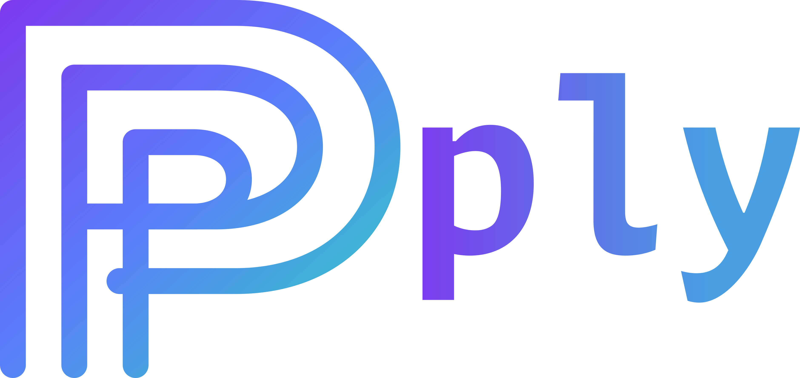
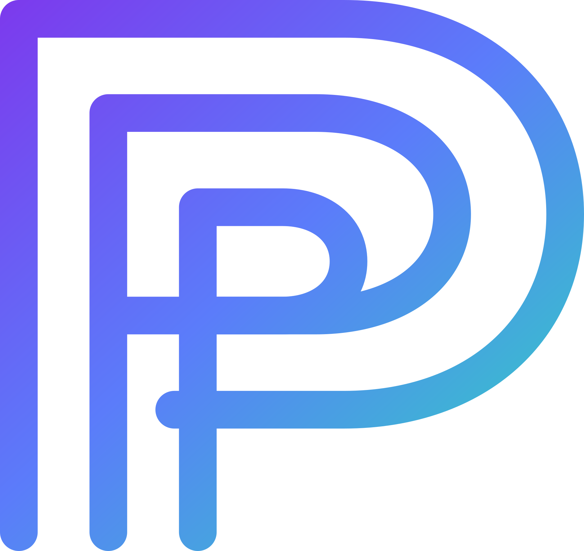

<p align="center">
  
</p>

# Ply

[](https://github.com/jeansimeoni/ply/actions/workflows/ci.yml)
[](https://github.com/jeansimeoni/ply/releases)
[](https://plycli.dev)
[](LICENSE)

Ply is a local-first package manager for coding-agent assets.

It composes reusable prompts, commands, skills, agents, rules, hooks, and
output styles for Codex and Claude Code without taking ownership of
repository-managed context.

It is built around the idea that developer tooling is both shared and personal.
Repositories need common context, but individual developers still have their
own way of thinking, reviewing, prompting, and working through a codebase.
Ply makes room for that personal layer without asking the repository to
absorb every preference as shared project policy.

Website: <https://plycli.dev>

## The Reason

I see software development as a craft. Even when teams share standards,
style guides, and workflows, there is still something deeply personal about how
each developer works.

That does not go away with AI agents. If anything, it becomes more visible. A
developer might want specific prompts, commands, skills, rules, hooks, or
output styles that fit how they think, review code, or structure their work.

The problem is that most developers also work in teams, and a shared repository
cannot realistically absorb every personal preference without turning into a
mess. That is the gap Ply is meant to fill.

The overlay idea is the core of it. I want to tailor the project repo I am
working on to my own workflow without disrupting the work of others or taking
ownership away from the repository itself.

That is why Ply is additive by default. It works well for teams that want
shared agent tooling without replacing files like `AGENTS.md`, `CLAUDE.md`,
`.agents/`, or `.claude/`, while still leaving room for each developer's own
layer on top.

## Notes

The current release baseline focuses on local-first package consumption,
package authoring, deterministic generation, and safe composition for Codex and
Claude Code. The broader multi-runtime direction is part of the project vision,
but the currently supported runtimes are the ones above.

The ownership boundary is also intentional: Ply augments a repo, it does not
try to replace the repo's own context. That bias shows up in things like
additive generation, namespaced managed assets, and clone-local ignore behavior
through `.git/info/exclude`.

## Core Features

- Compose reusable prompts, commands, skills, agents, rules, hooks, and output
  styles without copying opaque folders between repos
- Keep repository-owned context repository-owned instead of letting a tool take
  over files such as `AGENTS.md` or `CLAUDE.md`
- Layer project sources and optional user-global sources so personal workflow
  details can live beside team-shared context
- Resolve local-path and Git package sources with locked revisions recorded in
  `ply.lock`
- Generate deterministic managed output under `.ply/generated/` with drift
  detection and safety checks before cleanup or overwrite decisions

## Platform Support

Ply currently targets macOS and Linux command-line workflows.

Supported coding-agent runtimes today:

- Codex
- Claude Code

## Installation

Install methods currently available include:

- GitHub Releases
- cargo-dist shell installer
- downloadable `.deb` and `.rpm` packages
- source builds

Homebrew and AUR publishing are available for stable releases. Prerelease tags
continue to ship through GitHub Releases and source builds.

Install the latest stable release with the shell installer:

```bash
curl --proto '=https' --tlsv1.2 -LsSf https://github.com/jeansimeoni/ply/releases/latest/download/ply-installer.sh | sh
ply -V
```

If you want a prerelease build or prefer a manual download, pick the release
artifact you want from GitHub Releases.

If you want to build from source, this repository uses
[`mise`](https://mise.jdx.dev/) to manage tool versions, so the simplest path
is to let `mise` provision the pinned Rust toolchain automatically.

With `mise` installed, build from source like this:

```bash
git clone https://github.com/jeansimeoni/ply.git
cd ply
mise install
mise exec -- cargo build --release
./target/release/ply -V
```

For manual binary placement after building from source:

```bash
install -Dm755 target/release/ply ~/.local/bin/ply
ply -V
```

See [Install](docs/install.md) for the exact commands, release download
methods, package-manager installs, update paths, and uninstall steps.

## Quick Start

Initialize Ply in a Git repository:

```bash
ply init
```

If you want to start with one runtime only:

```bash
ply init --adapters codex
ply init --adapters claude
```

Add a package source:

```bash
ply add --id team --git owner/ply-team --rev main
```

Preview the composition and then apply it:

```bash
ply apply --dry-run
ply apply
```

Useful commands:

```bash
ply --help
ply --version
ply diff
ply doctor
ply list
ply sources
```

### Git worktrees

Ply supports linked Git worktrees without requiring configuration to be copied
into every checkout.

- If the active worktree contains `ply.toml`, Ply uses that configuration.
- Otherwise, Ply resolves configuration from the main worktree.
- Generated assets and ownership state remain isolated in the active worktree.
- Project command reports show both the configuration root and active worktree.

Configuration-changing commands update the resolved configuration root. Running
`ply clean` from a linked worktree removes only that worktree's generated state
and managed outputs; it does not remove shared configuration.

## Donate

If you like this project, you can buy me a beer! It would be really
appreciated.

Donations will help fund ongoing Ply development, releases, maintenance, and
documentation work.

- <a href="https://github.com/sponsors/jeansimeoni">
  GitHub Sponsors</a>
- <a href="https://www.paypal.com/donate/?business=AVKKMCJ3P77HG&no_recurring=0&item_name=Help+the+development+of+Ply&currency_code=BRL">
  PayPal</a>
- <a href="bitcoin:166SB7XLCgoZM75paAag5XGgjuHTdxFBgY">
  Bitcoin</a> `166SB7XLCgoZM75paAag5XGgjuHTdxFBgY` _BTC network only._

## Documentation

- [Install](docs/install.md)
- [Consume packages in a project repo](docs/guides/consume-packages-project.md)
- [Use a global Ply layer](docs/guides/global-layer.md)
- [Manage managed assets](docs/guides/manage-managed-assets.md)
- [Create your first package](docs/guides/create-package.md)
- [CLI reference](docs/reference/cli.md)
- [Package format and asset kinds](docs/reference/package-format.md)
- [Configuration and layering](docs/reference/configuration-and-layering.md)
- [Troubleshooting](docs/reference/troubleshooting.md)

## Check My Other Projects

- [Triginta](https://github.com/jeansimeoni/triginta) - A local-first terminal
  app for Pomodoro tracking and task management.

## Development

Contributor workflow, release details, and contribution guidelines live in
[CONTRIBUTING.md](CONTRIBUTING.md).

Run the main local checks with:

```bash
mise exec -- cargo fmt --check
mise exec -- cargo clippy --all-targets -- -D warnings
mise exec -- cargo test --locked
```

## License

Ply is licensed under the GNU General Public License version 3 only
(`GPL-3.0-only`). See [LICENSE](LICENSE).

<p align="center">
  
</p>
